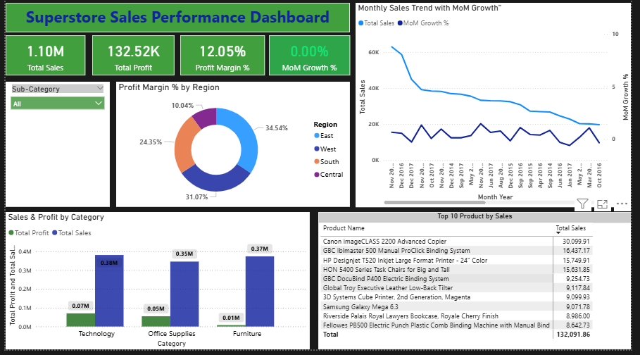

# Superstore-Sales-Dashboard
Power BI Sales Dashboard Project with DAX and Data Visualization
# 📊 Superstore Sales Dashboard (Power BI)

## 🚀 Project Overview
This is an interactive Sales Performance Dashboard built using Power BI on a retail dataset.  
It helps analyze sales, profit, and growth trends.

---

## 🔹 Key Features
- Total Sales, Total Profit, Profit Margin %
- Month-over-Month (MoM) Growth using DAX
- Dynamic filters (Category & Sub-Category)
- Monthly Sales Trend Analysis
- Regional Profitability Breakdown
- Top 10 Products by Sales

---

## 📊 Key Insights
- High sales does not always mean high profit
- Sales show fluctuations over time (growth trends)
- Top products contribute major revenue

---

## 🛠 Tools Used
- Power BI
- DAX (Data Analysis Expressions)
- Data Cleaning & Visualization

---

## 📷 Dashboard Preview

