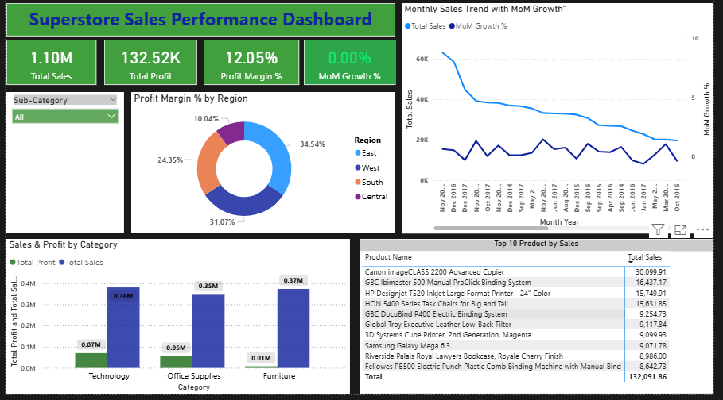

# 📊 Superstore Sales Performance Dashboard (Excel & Power BI)

An end-to-end Business Intelligence project using **Microsoft Excel** for data cleaning and **Power BI** for data modeling, DAX measures, and interactive dashboard creation.

## 📌 Project Overview
This project focuses on analyzing retail store sales to track key business metrics like Total Sales, Profit Margin, MoM Growth, and Category Performance.

## 🎯 Business Objectives
* Track key metrics: Total Sales, Total Profit, and Profit Margin %.
* Analyze regional profit distribution and category performance.
* Identify Top 10 products by revenue.

## 🚀 Technologies Used
* **Microsoft Excel** (Data Cleaning & Structuring)
* **Power BI Desktop** (Data Modeling, Visualizations)
* **DAX** (Custom Measures & Metrics)

## 📊 Dashboard Visuals
* **Top KPI Cards:** Total Sales, Total Profit, Profit Margin %, MoM Growth %
* **Slicer:** Sub-Category Dropdown Filter
* **Donut Chart:** Profit Margin % by Region
* **Line & Clustered Chart:** Monthly Sales Trend
* **Bar Chart:** Sales & Profit by Category
* **Table:** Top 10 Products by Sales

## 📂 Project Files
* `Sample_Superstore_Export.xlsx` - Cleaned Excel Data
* `superstore_dashboard.pbix` - Interactive Power BI File
* `dashboard.png` - Dashboard Screenshot

## 👩‍💻 Author
**Payal Chak** | Aspiring Data Analyst

